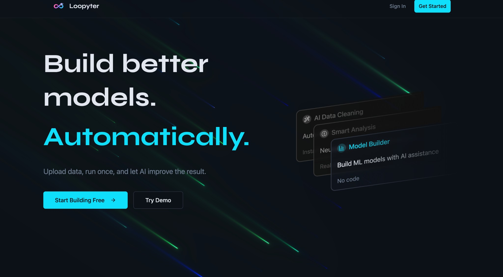
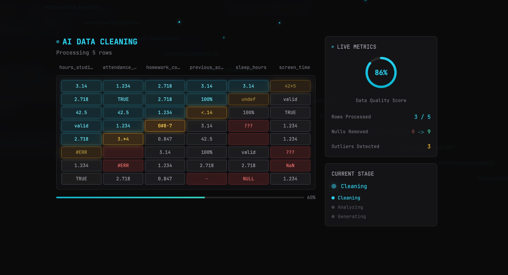
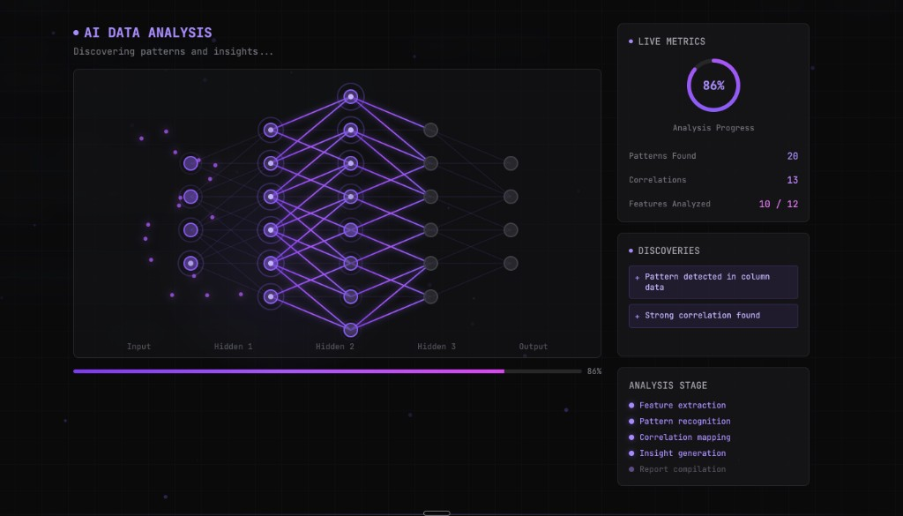
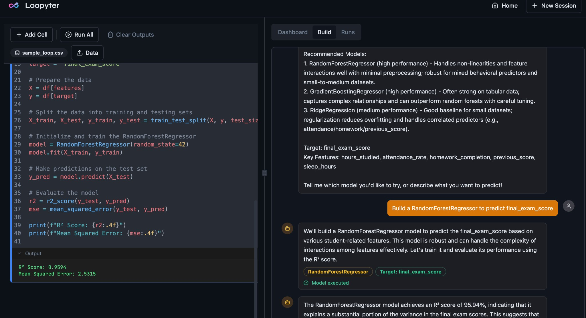

# Loopyter

<div align="center">

**Build better models. Automatically.**

*Upload data, run once, and let AI improve the result.*

[](https://opensource.org/licenses/MIT)
[](https://www.typescriptlang.org/)
[](https://reactjs.org/)
[](https://bun.sh/)

</div>

---

## 🚀 What is Loopyter?

Loopyter is an intelligent, browser-based machine learning platform that combines the power of Jupyter notebooks with AI assistance. Write Python code, upload your data, and let AI automatically clean, analyze, and optimize your models—all without leaving your browser.

### Key Highlights

- 🧠 **AI-Powered Workflow**: Automated data cleaning, analysis, and model optimization
- 📊 **No-Code Model Building**: Describe what you want to predict, AI generates the code
- 🔄 **Self-Improving Experiments**: AI suggests better models and tracks performance automatically
- 🌐 **Browser-Based**: Runs entirely in your browser using Pyodide—no server setup needed for Python execution
- 📈 **Real-Time Dashboard**: Live metrics, visualizations, and model leaderboards

---

## 🎯 The Complete Workflow

### 1. **Get Started** - Intuitive Landing Experience



Start with a clean, modern interface that guides you through the ML workflow. Upload your data or try the demo to see Loopyter in action.

**Features:**
- One-click data upload
- Demo dataset available
- Clear navigation to core features

---

### 2. **AI Data Cleaning** - Intelligent Preprocessing



Loopyter's AI agent automatically analyzes your data quality and identifies issues before you even start modeling.

**What it does:**
- **Live Quality Metrics**: Real-time data quality score (86% shown above)
- **Issue Detection**: Identifies nulls, outliers, and data inconsistencies
- **Visual Feedback**: Color-coded cells highlight problems (yellow = warnings, red = errors)
- **Progress Tracking**: See exactly what's being processed and cleaned

**Key Metrics Tracked:**
- Data Quality Score
- Rows Processed
- Nulls Identified & Removed
- Outliers Detected

---

### 3. **AI Data Analysis** - Discover Patterns Automatically



After cleaning, AI analyzes your data structure and discovers hidden patterns, correlations, and insights.

**Capabilities:**
- **Neural Network Visualization**: See the analysis process in real-time
- **Pattern Recognition**: Automatically finds patterns in your data
- **Correlation Mapping**: Identifies relationships between features
- **Smart Visualizations**: AI suggests the best charts for your data
- **Feature Analysis**: Tracks which features have been analyzed

**Live Metrics:**
- Analysis Progress (86% complete)
- Patterns Found (20 detected)
- Correlations Discovered (13 identified)
- Features Analyzed (10/12 complete)

---

### 4. **Model Builder** - AI-Assisted ML Development



The heart of Loopyter: an integrated notebook with an AI assistant that helps you build, test, and improve models.

**How it works:**

1. **Tell AI What to Predict**
   - Simply describe your goal: *"Predict exam_score using hours_studied"*
   - AI understands your intent and suggests the best models

2. **AI Generates Code**
   - Automatically creates optimized Python code
   - Uses appropriate libraries (scikit-learn, pandas, numpy)
   - Includes proper train-test splits and evaluation metrics

3. **Run & Evaluate**
   - Code executes in the browser (no server needed)
   - Results appear instantly with metrics like R² Score, MSE
   - AI analyzes performance and suggests improvements

4. **Experiment & Compare**
   - AI recommends alternative models to try
   - Each experiment is logged automatically
   - Compare all models in the leaderboard

**Example Output:**
```
R² Score: 0.9594 (95.94% variance explained)
Mean Squared Error: 2.5315
```

---

## ✨ Core Features

### 🤖 AI-Powered Capabilities

- **Automated Data Cleaning**: AI detects and fixes data quality issues
- **Smart Data Analysis**: Discovers patterns, correlations, and insights automatically
- **Intelligent Model Recommendations**: Suggests the best algorithms for your task
- **Performance Analysis**: Automatically detects metrics from code output
- **Model Improvement Suggestions**: AI recommends how to improve your models

### 📓 Notebook Experience

- **Jupyter-Style Interface**: Familiar cell-based workflow
- **Browser-Based Python**: Pyodide runs Python entirely in your browser
- **No Special Format Required**: Just write normal ML code—AI understands it
- **Real-Time Execution**: See results instantly as you code

### 📊 Dashboard & Analytics

- **Live Metrics**: Real-time updates as you work
- **Model Leaderboard**: Track all experiments sorted by performance
- **Confusion Matrices**: Visual model evaluation
- **Performance Charts**: Compare models visually
- **Data Visualizations**: AI-suggested charts for your data

### 🔄 Workflow Management

- **Persistent State**: Your work is saved automatically
- **Session Management**: Multiple projects, easy switching
- **Experiment Tracking**: Every model run is logged
- **Export Capabilities**: Download your results and code

---

## 🛠️ Tech Stack

### Frontend
- **React 18** + **TypeScript** - Modern, type-safe UI
- **Vite** - Lightning-fast build tool
- **Tailwind CSS** + **shadcn/ui** - Beautiful, accessible components
- **CodeMirror** - Professional code editor
- **Pyodide** - Python in WebAssembly (runs entirely in browser)
- **Recharts** - Data visualizations

### Backend
- **Bun** - Fast JavaScript runtime
- **Hono** - Lightweight web framework
- **Prisma** + **SQLite** - Database and ORM
- **Better Auth** - Authentication system
- **OpenAI API** - GPT-4o for AI features

---

## 🚀 Quick Start

### Prerequisites

- [Bun](https://bun.sh) (latest version)
- Node.js 18+ (if not using Bun)
- OpenAI API key
- Resend API key (for email authentication)

### Installation

1. **Clone the repository**
   ```bash
   git clone https://github.com/your-username/loopyter.git
   cd loopyter
   ```

2. **Install dependencies**
   ```bash
   # Backend
   cd backend
   bun install
   
   # Frontend
   cd ../webapp
   bun install
   ```

3. **Set up environment variables**

   **Backend** (`backend/.env`):
   ```bash
   PORT=3000
   OPENAI_API_KEY=sk-your-key-here
   RESEND_API_KEY=re_your-key-here
   DATABASE_URL="file:./dev.db"
   BETTER_AUTH_SECRET=your-secret-key-min-32-chars
   BETTER_AUTH_BASE_URL=http://localhost:3000
   BACKEND_URL=http://localhost:3000
   ```

   **Frontend** (`webapp/.env`):
   ```bash
   VITE_BACKEND_URL=http://localhost:3000
   ```

4. **Initialize database**
   ```bash
   cd backend
   bunx prisma generate
   bunx prisma db push
   ```

5. **Start the servers**

   **Terminal 1 - Backend:**
   ```bash
   cd backend
   bun run dev
   ```

   **Terminal 2 - Frontend:**
   ```bash
   cd webapp
   bun run dev
   ```

6. **Open your browser**
   - Navigate to `http://localhost:8000`
   - Sign up with your email
   - Start building models!

---

## 📖 Usage Guide

### Uploading Data

1. Click **"Upload Data"** in the notebook toolbar
2. Select your CSV file
3. AI automatically cleans and analyzes your data
4. Review cleaning suggestions and approve
5. Data is ready to use in your code!

### Building Models

**Option 1: Use AI Model Builder**
1. Go to the **"Build"** tab
2. Tell AI what you want to predict: *"Predict sales using marketing spend"*
3. AI generates code and runs it automatically
4. Review results and try suggested alternatives

**Option 2: Write Your Own Code**
1. Write Python ML code in notebook cells
2. Use standard libraries: pandas, scikit-learn, numpy
3. Run cells—AI automatically detects metrics
4. View results in Dashboard and Leaderboard

### Experimenting

- AI suggests alternative models after each run
- Click **"Run All"** to test multiple models
- Compare performance in the **Runs** tab leaderboard
- Each experiment is automatically logged

---

## 🌐 Deployment

### Backend (Render/Railway)

1. Set **Root Directory** to `backend`
2. Set **Build Command** to `bun install && bunx prisma generate`
3. Set **Start Command** to `bun src/index.ts`
4. Add environment variables (see `PRODUCTION.md`)

### Frontend (Vercel)

1. Set **Root Directory** to `webapp`
2. Set **Build Command** to `bun run build`
3. Set **Output Directory** to `dist`
4. Add `VITE_BACKEND_URL` environment variable

See `DEPLOYMENT.md` for detailed instructions.

---

## 📚 API Reference

| Endpoint | Method | Description |
|----------|--------|-------------|
| `/api/sessions` | POST | Create new session |
| `/api/ai/clean-data` | POST | AI suggests data cleaning operations |
| `/api/ai/analyze-data` | POST | AI analyzes data and suggests visualizations |
| `/api/ai/model-chat` | POST | AI chatbot generates ML code from natural language |
| `/api/ai/detect-model-output` | POST | AI auto-detects model metrics from code output |
| `/api/ai/analyze-model` | POST | AI analyzes model and generates feature experiments |
| `/api/ai/improve` | POST | AI suggests model improvements |

---

## 🤝 Contributing

Contributions are welcome! Please feel free to submit a Pull Request.

1. Fork the repository
2. Create your feature branch (`git checkout -b feature/AmazingFeature`)
3. Commit your changes (`git commit -m 'Add some AmazingFeature'`)
4. Push to the branch (`git push origin feature/AmazingFeature`)
5. Open a Pull Request

---

## 📝 License

This project is licensed under the MIT License - see the LICENSE file for details.

---

## 🙏 Acknowledgments

- Built with [Pyodide](https://pyodide.org/) for browser-based Python execution
- Powered by [OpenAI GPT-4o](https://openai.com/) for AI capabilities
- UI components from [shadcn/ui](https://ui.shadcn.com/)

---

<div align="center">

**Made with ❤️ for the ML community**

[Report Bug](https://github.com/your-username/loopyter/issues) · [Request Feature](https://github.com/your-username/loopyter/issues) · [Documentation](https://github.com/your-username/loopyter/wiki)

</div>
